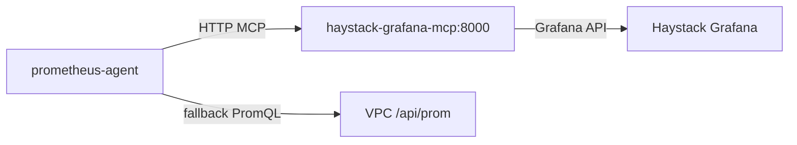

# Haystack Grafana MCP (tenant: `fw-noc`)

Based on [Grafana MCP Server - Haystack (Confluence)](https://confluence.freshworks.com/spaces/HAYS/pages/587778648/Grafana+MCP+Server).

Haystack exposes **metrics.haystack.es** (Grafana UI) and an **MCP server** so agents can run PromQL, search dashboards, and render panels.

## Two ways to connect

| Where you run | URL | Auth | Use case |
|---------------|-----|------|----------|
| **Cursor / IDE (VPN)** | `https://mcp.haystack.es/grafana/<tenant>` | Google identity JWT (`gcloud auth print-identity-token`) | Local dev, ad-hoc PromQL in chat |
| **EKS / VPC (n8n-prod)** | `http://o11y.int.haystack.es/mcp` | **FWSS token** (same as Haystack telemetry / `haystack--fw-noc--auth-token`) | In-cluster automation (read-only) |

**Tenant for NOC / n8n-prod:** `fw-noc`

---

## Cursor setup (VPN required)

### Prerequisites

- VPN with access to `metrics.haystack.es`
- Python 3.10+
- [Google Cloud CLI](https://cloud.google.com/sdk/docs/install-sdk)

### Steps

```bash
gcloud auth login
export HAYSTACK_MCP_JWT="$(gcloud auth print-identity-token)"
```

Copy `.cursor/mcp.json.example` → `.cursor/mcp.json` and set the Bearer token (or use the helper script):

```bash
./scripts/setup-haystack-mcp-cursor.sh
```

Example config:

```json
{
  "mcpServers": {
    "grafana-fw-noc": {
      "url": "https://mcp.haystack.es/grafana/fw-noc",
      "headers": {
        "Authorization": "Bearer <GOOGLE_IDENTITY_JWT>"
      }
    }
  }
}
```

Reload Cursor: **Cmd+Shift+P** → **Developer: Reload Window**.

Verify: **Cursor Settings → MCP** → `grafana-fw-noc` should be green. Try: *"Search for dashboards related to noc"*.

### Troubleshooting (Cursor)

| Issue | Fix |
|-------|-----|
| Red / disconnected | Connect VPN; check `curl -I https://mcp.haystack.es/` |
| 401 Unauthorized | Regenerate JWT: `gcloud auth print-identity-token` |
| 403 Forbidden | Need Grafana View/Admin on the org |

---

## In-cluster (prometheus-agent / NOC bot)

### Recommended for PromQL: direct API (today)

The bot uses the **direct Prom API** on n8n-prod (fast, no Grafana hop):

- `PROMETHEUS_URL` → VPC `.../api/prom`
- `PROMETHEUS_ORG_ID` → `fw-noc`
- `PROMETHEUS_TOKEN` → FWSS token from `haystack/haystack--fw-noc--auth-token`
- `PROMETHEUS_QUERY_BACKEND` → `direct` (default)

Sync from cluster:

```bash
./scripts/sync-prometheus-haystack-secret.sh
kubectl rollout restart deployment/prometheus-agent -n a2a-ops
```

### Optional: Haystack Grafana MCP in-cluster

Haystack documents VPC MCP at `http://o11y.int.haystack.es/mcp` with the **same FWSS token** (not Google JWT).

| Variable | Value |
|----------|--------|
| `HAYSTACK_MCP_URL` | `http://o11y.int.haystack.es/mcp` |
| `HAYSTACK_MCP_TENANT` | `fw-noc` |
| `HAYSTACK_MCP_TOKEN` | Same as `PROMETHEUS_TOKEN` |
| `PROMETHEUS_QUERY_BACKEND` | `direct` \| `mcp` \| `auto` |

| Mode | Behavior |
|------|----------|
| `direct` | PromQL only via `/api/prom` (**use this now**) |
| `mcp` | PromQL only via MCP `query_prometheus` tool |
| `auto` | Try MCP first; on 401/error fall back to direct Prom |

**Current status (n8n-prod):** MCP returns **401 Unauthorized** from `a2a-ops` pods with the FWSS token. Direct `/api/prom` returns **200**. Ask observability to enable in-cluster MCP auth for tenant `fw-noc`; then set `PROMETHEUS_QUERY_BACKEND=auto` to use MCP for metric discovery while keeping Prom as fallback.

Optional (if MCP needs a fixed datasource):

- `HAYSTACK_MCP_DATASOURCE_UID` — Grafana Prometheus datasource UID
- `HAYSTACK_MCP_QUERY_TOOL` — override tool name (default: auto-detect `grafana_query_prometheus` / `query_prometheus`)

---

## Useful MCP tools (Prometheus)

| Tool | Purpose |
|------|---------|
| `grafana_list_prometheus_metric_names` | Discover metrics (run before query) |
| `grafana_list_prometheus_label_values` | Label values for filters |
| `grafana_query_prometheus` | Run PromQL (instant or range) |

Workflow: **list metrics → list labels → query**.

---

## NOC bot vs MCP

| Layer | Today |
|-------|--------|
| **Slack RPM answer** | Alert metadata (`current_value`, `threshold`) — works |
| **Live Prom (in-cluster)** | Direct API `.../api/prom` + `X-Scope-OrgID: fw-noc` — works for K8s series |
| **Live Prom via in-cluster MCP** | Env wired; MCP **401** until observability enables FWSS on `o11y.int.haystack.es/mcp` |
| **Live Prom by `hostname=app-*`** | Often empty in fw-noc; use correct product metric + `PROMQL_HOSTNAME_QUERY` from observability |
| **Cursor MCP** | Use `grafana-fw-noc` + Google JWT for interactive investigation |

---

## Peering + log shipping vs MCP

| Capability | What peering / FWSS enables | What it does **not** enable |
|------------|---------------------------|-----------------------------|
| Log push to Haystack | Yes | — |
| Metrics remote_write / query `/api/prom` | Yes | — |
| Haystack **managed** MCP at `o11y.int.haystack.es/mcp` | — | Needs MCP layer auth (today **401**) |
| Self-hosted MCP in your cluster | — | Needs **Grafana API** URL + token (see below) |

So: **peering is necessary but not sufficient for MCP.** Your bot can query Prom today without MCP.

---

## Option 1 — Haystack managed MCP (preferred, no extra pod)

Haystack runs MCP at `http://o11y.int.haystack.es/mcp`. Your agents stay **clients** only.

**Ask observability:**

> Peering and FWSS work for `/api/prom` and log shipping on **fw-noc**. Please enable the same FWSS bearer on **`http://o11y.int.haystack.es/mcp`** for EKS namespace **a2a-ops** (JSON-RPC `initialize`).

Then:

```bash
./scripts/sync-prometheus-haystack-secret.sh
# secret already has HAYSTACK_MCP_URL=http://o11y.int.haystack.es/mcp
kubectl set env deployment/prometheus-agent -n a2a-ops \
  PROMETHEUS_QUERY_BACKEND=auto --containers=agent
kubectl rollout restart deployment/prometheus-agent -n a2a-ops
```

---

## Option 2 — Host MCP server in your cluster

Run [grafana/mcp-grafana](https://github.com/grafana/mcp-grafana) in **a2a-ops**; `prometheus-agent` calls it over ClusterIP.



**You still need from observability:**

1. **GRAFANA_URL** — Grafana API base reachable from pods (may be `https://metrics.haystack.es` or an internal URL; not the Prom VPC push URL).
2. **GRAFANA_SERVICE_ACCOUNT_TOKEN** — Grafana service account with View + datasource query (may **not** be the same as the 32-char FWSS telemetry token).
3. **GRAFANA_ORG_ID** — org id for tenant **fw-noc** (if multi-tenant Grafana).

**Deploy:**

```bash
GRAFANA_URL='https://metrics.haystack.es' \
GRAFANA_SERVICE_ACCOUNT_TOKEN='<from-observability>' \
GRAFANA_ORG_ID='<org-id>' \
./scripts/create-haystack-mcp-server-secret.sh

kubectl apply -f deploy/kubernetes/deployment-haystack-mcp.yaml

# Wire prometheus-agent to in-cluster MCP
HAYSTACK_MCP_URL=http://haystack-grafana-mcp.a2a-ops.svc.cluster.local:8000 \
PROMETHEUS_QUERY_BACKEND=auto \
./scripts/sync-prometheus-haystack-secret.sh
# Add PROMETHEUS_QUERY_BACKEND to secret manually if not in sync script yet:
# kubectl set env deployment/prometheus-agent -n a2a-ops PROMETHEUS_QUERY_BACKEND=auto

kubectl rollout restart deployment/prometheus-agent -n a2a-ops
```

Test MCP pod:

```bash
kubectl exec -n a2a-ops deploy/prometheus-agent -- python3 -c "
import httpx, os
url=os.environ.get('HAYSTACK_MCP_URL','http://haystack-grafana-mcp.a2a-ops.svc.cluster.local:8000')
r=httpx.post(url, json={'jsonrpc':'2.0','id':1,'method':'initialize',
  'params':{'protocolVersion':'2024-11-05','capabilities':{},
  'clientInfo':{'name':'t','version':'1'}}}, timeout=15)
print(r.status_code, r.text[:200])
"
```

Expect **200** and a JSON-RPC `result`, not 401.

---

## Reference

- Confluence PDF (local): `Grafana MCP Server - Haystack - Confluence.pdf`
- Public MCP project: [grafana/mcp-grafana](https://github.com/grafana/mcp-grafana)
- In-cluster MCP manifest: `deploy/kubernetes/deployment-haystack-mcp.yaml`
